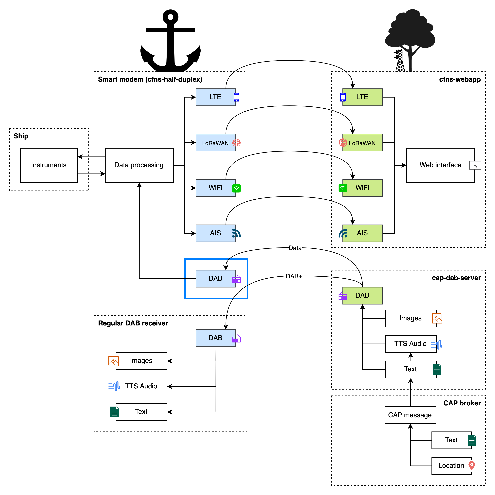

# dab-receiver

This repository contains a receiver, which is able to receive arbitrary DAB+ packages.
This application is meant to interface with cfns-half-duplex, see the diagram
below.



## Requirements

librtlsdr-dev
fftw3
git
g++
cmake
autoconf
libasio-dev
gnuradio-dev
libboost-dev
libtins-dev
pkg-config

## Building
```
$ git clone https://github.com/PoCDAB/dab-receiver.git
$ cd dab-receiver/build
$ mkdir -p build
$ cmake ..
$ make
```
The resulting binaries can be found in `<build-directory>/products/bin`

## Running

### Receiver
Running the receiver requires an SDR device compatible with **librtlsdr**.
Default packet address is 1000.

```
$ ./build/products/bin/receiver <packet_address>
```

TODO elaborate

# Credit
Forked from [data-over-dab-example](https://github.com/Opendigitalradio/data-over-dab-example)
by Opendigitalradio. See LICENSE for more information.
